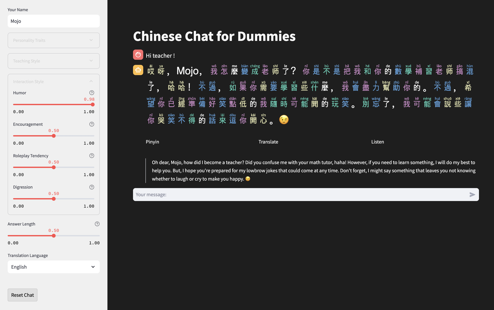

# chitchat-in-chinese
Learn Chinese with a cute bot



Chinese Chat for Dummies is an interactive language learning application that provides a unique and engaging way to practice Chinese conversation skills. This app uses advanced AI to simulate conversations with a Chinese speaker, allowing users to improve their language abilities in a fun and dynamic environment.

## Features

- **Customizable AI Personality**: Adjust various traits to create a unique conversation partner.
- **Real-time Translations**: Get instant translations of the Chinese text in your preferred language.
- **Pinyin Display**: Toggle Pinyin for easier pronunciation understanding.
- **Text-to-Speech**: Listen to the correct pronunciation of Chinese phrases.
- **Colorized Tones**: Visual representation of Chinese tones for better tone recognition.

## Getting Started

1. Clone this repository
2. Install the required dependencies:
   ```
   pip install -r requirements.txt
   ```
3. Run the Streamlit app:
   ```
   streamlit run app.py
   ```

## Requirements

- Python 3.7+
- OpenAI API key
- Streamlit
- gTTS
- jieba
- pypinyin
- langchain

## Usage

1. Enter your OpenAI API key in the sidebar.
2. Customize the AI personality traits to your liking.
3. Start chatting in Chinese!
4. Use the Pinyin, Translate, and Listen buttons to aid your understanding.

## Contributing

Contributions are welcome! Please feel free to submit a Pull Request.

## License

This project is licensed under the MIT License.
